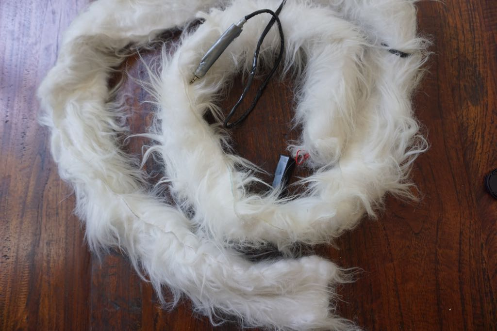

# Arduino LED Scarf and Top Hat

## Overview

This art project was for [Kiwiburn](http://kiwiburn.com/) 2016 and 2017,
the regional Burning Man in New Zealand.

An Arduino Nano powers LEDs in a fully scarf and stylish top hat,
with buttons for mode controls.
Comes with click-based beat matching and various "drop modes"
for maximum awesomeness on electronic music.

Check out more modes in the [full video](https://vimeo.com/202582452).

## Features

 * Beat button (button 1): Tap out beats, the patterns will adjust their speed
 * Brightness switcher (button 2): Three brightness levels, avoid blinding people in dark spaces
 * Mode switcher (button 3)
  * BPM: Trails emanating from the scarf centre, down both halves
  * Heartbeat: Trails following the human heart beat curve
  * Plasma: Sine wave (single factor plasma) that moves up the strip
  * Juggle: Eight colored dots, weaving in and out of sync with each other
  * Sinelon: A colored dot sweeping back and forth, with fading trails
  * Confetti: Colourful, randomized dots in main palette colour.
    Drop mode switches to rainbow colours.
 * Palette switcher (long-press button 3): Three palettes built-in (ocean, lava, rainbow)
 * Drop mode (button 4): Brighter variations of the current mode (e.g. strobe mode)

## Software

You'll need [Platform.io](http://platformio.org/) to build this (or move some files around to build with the default Arduino IDE).

## Shopping List

 * 1x Arduino Nano
 * 150ish [Neopixel LEDs](https://learn.adafruit.com/adafruit-neopixel-uberguide/overview)
 * 2x 18650 battery (plus [holders](https://www.aliexpress.com/item/New-18650-Battery-Holder-Box-Case-Black-With-Wire-Lead-3-7V-Clip-5-Pcs-high/32580480645.html?spm=2114.13010608.0.0.yXEwNk))
 * 1x 3DOF accelerometer
 * 4x push buttons
 * 2x power switches
 * 1x [Veroboard](https://www.aliexpress.com/item/10-pcs-lot-universal-Stripboard-Veroboard-vero-Board-Single-Side-5x7cm-bakelite-universal-experiment-circuit-board/32321654013.html?spm=2114.13010608.0.0.hFFUTR) (optional)
 * 2x stereo headphone connectors, for power+data (optional)
 * 1x case (lunch box)
 * 1x 33yf/25V capacitor (optional, avoids sensor interference)

## Schematics

## Pictures

## Notes

Some hard learned lessons here, I've iterated on the concept,
and burned through three Nanos in the process :D

 * Adjust number of LEDs in main.cpp.
 * Add an extra battery at the end of the LED strip to ensure they get enough power (see [Powering Neopixels](https://learn.adafruit.com/adafruit-neopixel-uberguide/power))
 * A Veroboard will make it easier to solder the many connections,
   particularly with shared ground and power lines
 * The 3.5mm stereo audio jacks are used for power+data (NOT audio).
   It's a convenient and widely available form factor,
   but YYMV (JST connectors work just as well).
   More connections mean more points of failure,
   but it also makes the LED strips more reuseable.
 * With a max. draw of 500mAh (and a lot lower average),
   the batteries can power the scarf for around two nights of partying.
 * Keep cables long for the inevitable resolder (size your case accordingly)
 * Add some hot glue to make a waterproof case from a lunchbox

## Thanks

 * [bnolan](http://github.com/bnolan): For the hard work on the heartbeat visualisation
 * [sminnee](http://github.com/sminnee): For infinite resources in little electronic bits (nanos, connectors, buttons, you name it). Sam also wrote the bulk of the pattern list classes.
 * [stojg](http://github.com/stojg): For invaluable advice on how not to fuck up electronics (turns out you need capacitors!)
 * [caffeineinc](http://github.com/caffeineinc): For keeping my sanity, and the PARTY PANTS
 * [camp8bit](http://github.com/camp8bit): For a theme camp with great people

## LICENSE

Copyright 2017 Ingo Schommer

Redistribution and use in source and binary forms, with or without modification, are permitted provided that the following conditions are met:

1. Redistributions of source code must retain the above copyright notice, this list of conditions and the following disclaimer.

2. Redistributions in binary form must reproduce the above copyright notice, this list of conditions and the following disclaimer in the documentation and/or other materials provided with the distribution.

3. Neither the name of the copyright holder nor the names of its contributors may be used to endorse or promote products derived from this software without specific prior written permission.

THIS SOFTWARE IS PROVIDED BY THE COPYRIGHT HOLDERS AND CONTRIBUTORS "AS IS" AND ANY EXPRESS OR IMPLIED WARRANTIES, INCLUDING, BUT NOT LIMITED TO, THE IMPLIED WARRANTIES OF MERCHANTABILITY AND FITNESS FOR A PARTICULAR PURPOSE ARE DISCLAIMED. IN NO EVENT SHALL THE COPYRIGHT HOLDER OR CONTRIBUTORS BE LIABLE FOR ANY DIRECT, INDIRECT, INCIDENTAL, SPECIAL, EXEMPLARY, OR CONSEQUENTIAL DAMAGES (INCLUDING, BUT NOT LIMITED TO, PROCUREMENT OF SUBSTITUTE GOODS OR SERVICES; LOSS OF USE, DATA, OR PROFITS; OR BUSINESS INTERRUPTION) HOWEVER CAUSED AND ON ANY THEORY OF LIABILITY, WHETHER IN CONTRACT, STRICT LIABILITY, OR TORT (INCLUDING NEGLIGENCE OR OTHERWISE) ARISING IN ANY WAY OUT OF THE USE OF THIS SOFTWARE, EVEN IF ADVISED OF THE POSSIBILITY OF SUCH DAMAGE.